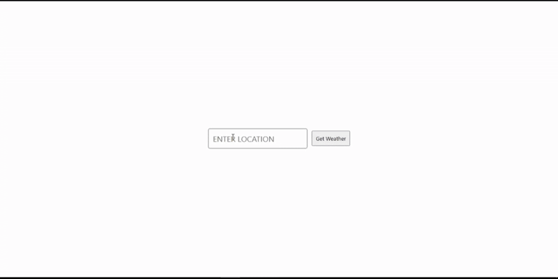

# ⛅ Simple Weather App

A weather checking app where the user can enter a location and get current weather details.  
It fetches live weather data and displays temperature, humidity, and conditions on the screen.  

This project was my **first time securely deploying an API key** using a backend server.  
I faced many challenges while setting it up, but I learned a lot about **APIs, JSON responses, async JavaScript, backend servers, and environment variables**.  
Moving forward, I plan to build many more such projects to strengthen my understanding of full-stack workflows. 🚀  

## 📂 Project Structure  

- **[Frontend (weather-frontend)](https://github.com/anshika-pathak005/weather-frontend)**  
  - Built with HTML, CSS, and JavaScript.  
  - Handles the UI where users can input a location and view the weather details.  

- **[Backend (weather-backend)](https://github.com/anshika-pathak005/weather-backend)**  
  - A simple Express.js server deployed on Render.  
  - Stores the API key securely in environment variables.  
  - Acts as a middle layer between the frontend and the OpenWeather API.  

## 🚀 Features  
- 🌍 Search weather by city name  
- 🌡 Shows temperature in Celsius  
- 💧 Displays humidity levels  
- ⛅ Shows weather condition with emoji  
- 🔒 Secure API key handling using backend  

## 🛠️ Tech Stack  
- **Frontend:** HTML, CSS, JavaScript  
- **Backend:** Node.js, Express.js  
- **Deployment:** Render (for backend)  

## 📸 Screenshot  

## 🔗 Live Demo  
- Frontend: *[https://weatherapp-4ozw.onrender.com/]*

